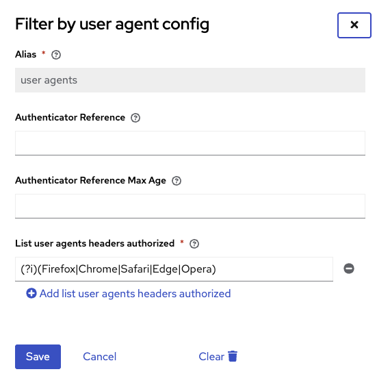

# Keycloak limit user agents Authenticator

[https://please-open.it](https://please-open.it)

## Goal

This plugin intend to give a list of authorized user agents to perform an authentication on Keycloak, according to the spec RFC8252 8.12

https://datatracker.ietf.org/doc/html/rfc8252#section-8.12

## Build

- Java 21
- Maven

`mvn clean install`

Then, copy generated jar file from `target` to the `providers` directory in Keycloak.

## Usage

In your authentication flow, add a new execution and search for "Filter by user agent".

In the authenticator configuration, you can define your own regular expressions to filter on :

By default, this authenticator filters on all common browser thanks to this regular expression :

`(?i)(Firefox|Chrome|Safari|Edge|Opera)`

Keycloak returns a `400 bad request` if the user agent is not satisfied by one of regular expressions in the list.
